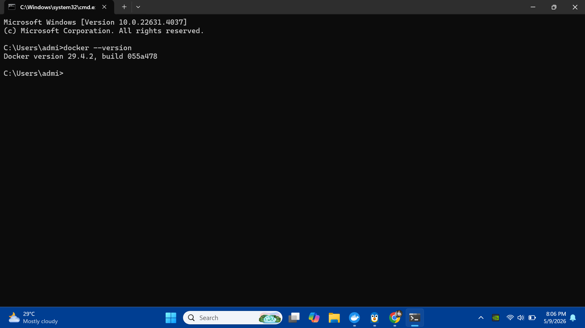
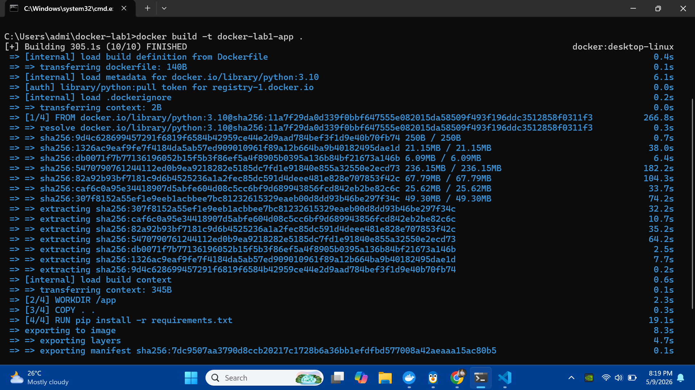
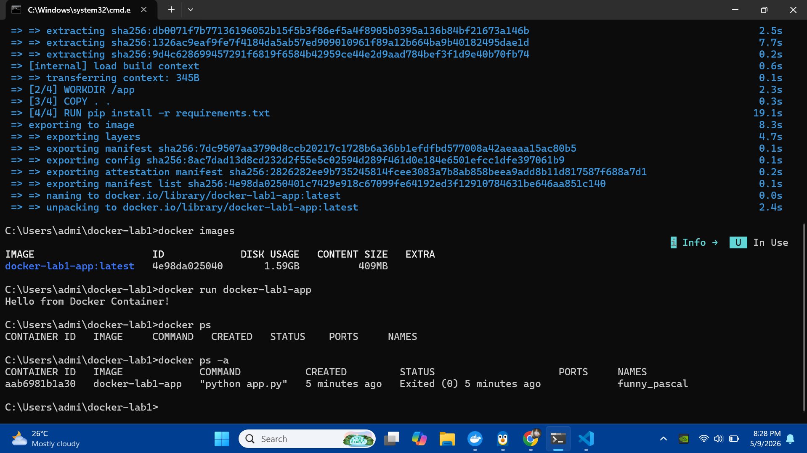
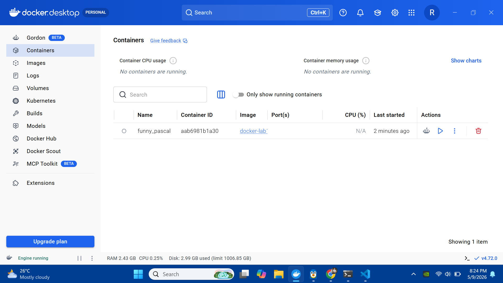
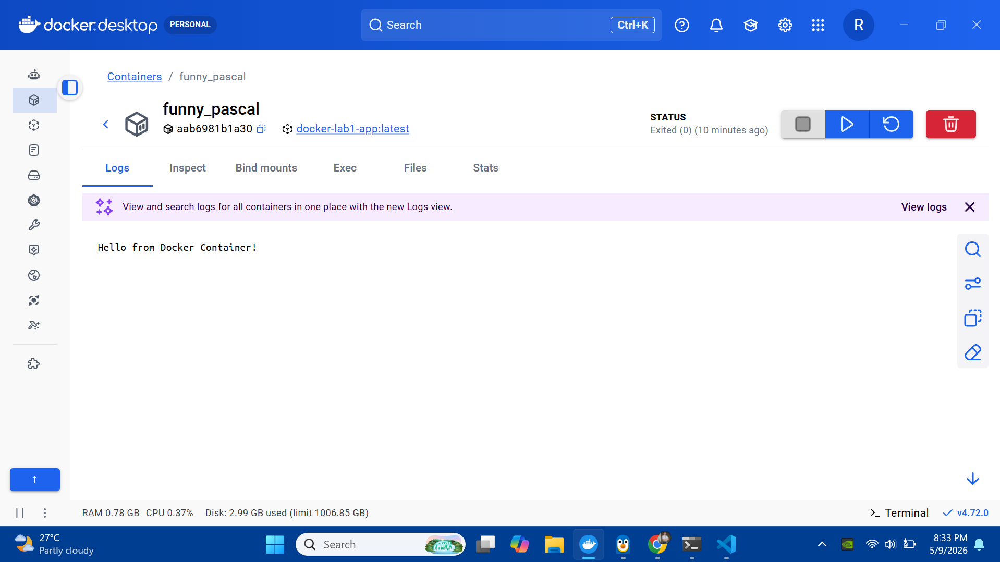
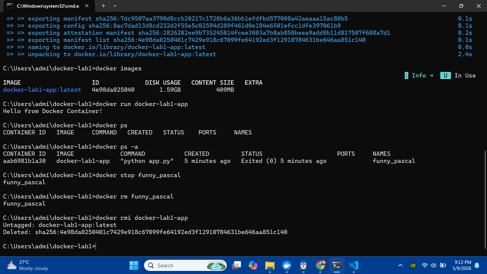

# Lab 1: Introduction to Docker Containerization

## 📌 Overview
This project demonstrates the basics of containerization using Docker. It involves creating a simple Python application, packaging it with a Dockerfile, and managing the image/container lifecycle through the terminal and Docker Desktop.

## 🛠️ Tech Stack
*   **Language:** Python 3.10
*   **Tool:** Docker Desktop
*   **Environment:** Windows (CMD / Terminal)

---

## 📸 Step-by-Step Execution Outputs

### 1. Verification
Start verify that Docker was correctly installed and accessible via the command line.


### 2. Building the Image
After setting up the `app.py` and `Dockerfile`, execute the build command to create the `docker-lab1-app` image.


### 3. Verification of Image and Container Run
verify that the image was created successfully and then ran the container to see the expected output: **"Hello from Docker Container!"**.


### 4. Docker Desktop Monitoring
Use the Docker Desktop GUI to monitor the container status and inspect the logs to ensure the application executed correctly.



### 5. Cleanup and Resource Management
Perform a full cleanup to reclaim system resources. This involved stopping the container, removing the instance, and deleting the Docker image.


---

## 🧠 Guide Questions

### 1. What role does the Dockerfile play in containerization?
The Dockerfile acts as the blueprint or manifest for the container. It contains the exact instructions (base image, environment setup, file copying, and start command) needed to recreate the application environment consistently on any machine.

### 2. Why are Docker containers lighter than virtual machines?
Containers are lighter because they share the host system's kernel instead of virtualizing a full operating system. This reduces overhead, saves disk space, and allows for near-instant startup times.

### 3. What happens when the container finishes execution?
Once the primary process (the Python script) finishes, the container enters an "Exited" state. It stops consuming CPU and RAM but remains in the system's record until it is manually removed.

---

## 🚀 How to Run
1.  **Clone the Repository:**
    ```bash
    git clone <your-repository-url>
    cd docker-lab1
    ```
2.  **Build the Image:**
    ```bash
    docker build -t docker-lab1-app .
    ```
3.  **Run the Container:**
    ```bash
    docker run docker-lab1-app
    ```

### To Shutdown & Cleanup:
1.  **Stop/Remove the Container:**
    ```bash
    docker rm <container_name_or_id>
    ```
2.  **Remove the Image:**
    ```bash
    docker rmi docker-lab1-app
    ```
3.  **Close Docker Desktop:**
    Right-click the Docker icon in the system tray and select **Quit Docker Desktop**.